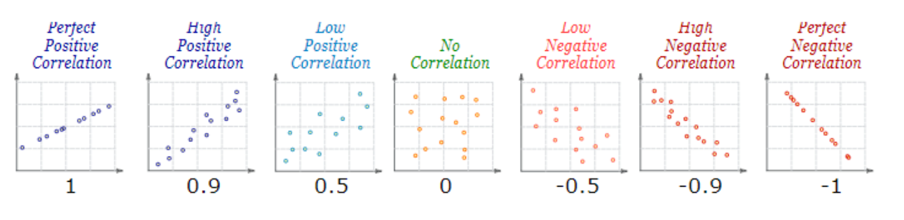

```{r setup, include=FALSE}
knitr::opts_chunk$set(echo = TRUE, warning = FALSE, message = FALSE) 
```
<div style="text-align: justify">

# Resumen

En este estudio se analiza la correlación y causalidad de los suicidios, la situación económica y la inaccesibilidad a sectores de salud mental principalemente. En estos casos ninguna de esas variables explica la cantidad de suicidios que se dan en cada comunidad autónoma, sin embargo, hay relación entre la inaccesibilidad a servicios de salud mental con la desigualdad económica de cada CCAA.

# Introducción

El suicidio es un problema de salud pública muy complejo en el que pueden intervenir diversos factores, en este caso nos centraremos en estudiar si hay una posible relación entre la salud mental y la posibilidad de acceso a los servicios sanitarios de ese ámbito, junto con la desigualdad económica entre la población española por comunidades. 

La medida de la desigualdad es un parámetro subjetivo, para medir la desigualdad se pueden utilizar distintos indicadores, entre ellos encontramos el cociente S80/S20, vamos a utilizar este indicador como base de la desigualdad económica. Éste mide, según la INE (Instituto Nacional de Estadística),la desigualdad a través de ratios entre percentiles. Se interpreta como la relación entre la renta media obtenida por el 20% de la población con la renta más alta (quintil más alto), en relación a la renta media obtenida por el 20% de la población con la renta más baja (quintil más bajo).(1)

En primer lugar, vamos a definir los siguientes conceptos claves:

* **Salud mental:**
*«La salud mental es un estado de bienestar mental que permite a las personas hacer frente a los momentos de estrés de la vida, desarrollar todas sus habilidades, poder aprender y trabajar adecuadamente y contribuir a la mejora de su comunidad».[@OMS](7)*
Este estado de bienestar mental muchas veces es alterado por perturvaciones, por lo que puede derivar a trastornos mentales, esto causa angustia y/o altera las capacidades funcionales de la persona.

* **Suicidio:**
*«Todo acto por el que un individuo se causa a sí mismo una lesión, o un daño, con un grado variable en la intención de morir, cualquiera sea el grado de intención letal o de conocimiento del verdadero móvil».[@OMS](8)*
Este acto es previamente meditado y realizado por una persona, que es totalemnte consciente de lo que realiza y el objetivo final de sus actos.

* **Desigualdad económica:**
*«Es la diferencia que existe en la distribución de bienes, ingresos y rentas dentro de un grupo, sociedad, país o entre países».[@ACNURComitéEspañol](9)*
Es la circunstancia en la que hay presente una diferencia, ya sea vinculada con la renta, el capital o bienestar económico entre los diferentes individuos de población en una concreta zona geográfica.
Esto es debido a que los recursos económicos no se distribuyen de manera equitativa.


# Objetivos
* **Objetivos principales:**
  * Comparar el nivel de suicidios que hay por cada comunidad autónoma en España según en el cociente S80/S20.
  * Comparar el nivel de suicidios que hay por cada comunidad autónoma en España según la inaccesibilidad a la atención sanitaria en el ámbito de salud mental.
  * Comparar la inaccesibilidad a la atención sanitaria en el ámbito de salud mental según en el cociente S80/S20.  

* **Objetivos secundarios:**
  * Comparar la relación entre suicidios e inaccesibilidad según los distintos tipos de inaccesibilidad (salud mental, atención médica o medicamento recetado)


# Materiales y Métodos

Los cuatro sets de datos que han sido utilizados durante todo el estudio han sido obtenidos de dos páginas principalmente.
Los sets de datos de los referentes al índice s80s20 (1) y población por CCAA (4) se han obtenido de la página del INE (Instituto Nacional de Estadística), en el caso de los sets de datos de suicidios (2) e inaccesibilidad (3) han sido obtenidos por la página de datos abiertos del Gobierno de España.


## Carga de los datos
### Carga de librerías
Se han utilizado las librerías de "readr" y "tidyverse" para poder modificar los set de datos tanto en csv como en json, por otro lado las librerías "rjson" y "tidyjson" han sido útiles poder manejar los datos de json. Además se ha añadido la librería cowplot para poder mostrar gráficas agrupadas.
```{r CargaLibrerías}
library(readr)
library(tidyverse)
library(rjson)
library(tidyjson)
library(cowplot)
```

### Carga de datos JSON
Se ha intentado trabajar con json pero debido a la complejidad del manejo de datos se ha decido continuar el estudio con los datos en csv.

```{r CargaDatosJSON}
# VERSIÓN JSON (Versión descartada)

#Desigualdad
desi <- fromJSON(file = "INPUT/DATA/desigualdad.json")

desi %>% 
  gather_object %>% 
  json_types %>% 
  count(name, type)

desi %>%
  enter_object(Data) %>%
  gather_array %>%
  spread_all %>%
  select(-document.id, -array.index)


#Inaccesibilidad
ina <- fromJSON(file = "INPUT/DATA/inaccesibilidad.json")

ina %>% 
  gather_object %>% 
  json_types %>% 
  count(name, type)

ina %>%
  enter_object(Data) %>%
  gather_array %>%
  spread_all %>%
  select(-document.id, -array.index)

#Suicidios
sui <- fromJSON(file = "INPUT/DATA/suicidios.json")

sui %>% 
  gather_object %>% 
  json_types %>% 
  count(name, type)

sui %>%
  enter_object(Data) %>%
  gather_array %>%
  spread_all %>%
  select(-document.id, -array.index)
```


### Carga de datos CSV
Estos serán los datos utilizados finalmente.

Para acomodar los datos y facilitar la literatura a la hora de utilizarlos, en primer lugar, se ha modificado el nombre de los set de datos importados de forma que sean más representativos y sin espacios ni caracteres especiales.

Se ha creado una columna en todos los set de datos que se llama "CA", esta columna va a tener los valores de todas las Comunidades Autónomas de España, se ha creado debido a que este atributo será utilizado con frecuencia, además se ha establezido como factor de forma que todos los valores de esta columna sean igual en todos los sets, y por tanto en todas las tablas para poder hacer los join pertinentes. 
En algunos sets de datos como "desigualdad.csv" o "suicidios.csv" había más valores aparte de las comunidades autónomas por lo que se han eliminado filtrando todos los niveles menos esos valores no deaseados y eliminando los niveles que han quedado sin filtrar.

Además, en el set de datos "suicidios.csv" se ha tenido que adaptar a un encoding en latín ya que tenía carateres raros.

En "desigualdad.csv" se han escogido sólo los datos referentes al año 2019, el año en el que se basa este estudio.

El set de datos "poblacion.csv" se ha utilizado para poder hacer una proporción entre los datos de cada comunidad y su población. Una comunidad con mucha población tendrá más datos con los que trabajar por lo que podría desviar el estudio, por lo que hay que estandarizar los datos.

```{r CargaDatosCSV}
# VERSIÓN CSV (Versión utlizada)

#Desigualdad
desi <- read_delim("INPUT/DATA/desigualdad.csv",
                   delim = ";", escape_double = FALSE, trim_ws = TRUE,
                   col_types = cols(
                     `Territorio`= readr::col_factor(levels = NULL)))

desi<-
  desi %>% 
  mutate(CA = factor(`Territorio`, levels = c("Andalucía", "Aragón", "Asturias", "Baleares, Islas", "Canarias", "Cantabria", "Castilla y León", "Castilla-La Mancha", "Cataluña", "Comunidad Valenciana", "Extremadura", "Galicia", "Madrid, Comunidad de", "Murcia, Región de", "Navarra", "País Vasco", "Rioja, La", "Ceuta", "Melilla", "España")))

desi<-
  desi %>% 
  filter(CA != "España") %>% 
  droplevels()

desi<-
  desi %>% 
  filter(`Año/curso académico` == 2019)

#Inaccesibilidad

ina <- read_delim("INPUT/DATA/inaccesibilidad.csv",
                  delim = ";", escape_double = FALSE, trim_ws = TRUE) 
col_types = cols(
  `Comunidades y Ciudades Autónomas` = readr::col_factor(levels = NULL))

ina<-
  ina %>% 
  mutate(CA = factor(`Comunidades y Ciudades Autónomas`,levels = c("Andalucía", "Aragón", "Asturias (Principado de)", "Balears (Illes)", "Canarias", "Cantabria", "Castilla y León", "Castilla-La Mancha", "Cataluña", "Comunitat Valenciana", "Extremadura", "Galicia", "Madrid (Comunidad de)", "Murcia (Región de)", "Navarra (Comunidad Foral de)", "País Vasco", "Rioja (La)", "Ceuta (Ciudad Autónoma de)", "Melilla (Ciudad Autónoma de)"), labels = c( "Andalucía", "Aragón", "Asturias", "Baleares, Islas", "Canarias", "Cantabria", "Castilla y León", "Castilla-La Mancha", "Cataluña", "Comunidad Valenciana", "Extremadura", "Galicia", "Madrid, Comunidad de", "Murcia, Región de", "Navarra", "País Vasco", "Rioja, La", "Ceuta", "Melilla")))


#Suicidios
sui <- read_delim("INPUT/DATA/suicidios.csv",
                  delim = ";", escape_double = FALSE, trim_ws = TRUE,locale=locale(encoding="latin1"), col_types = cols(
                    `Comunidad y ciudad autónoma de residencia` = readr::col_factor(levels = NULL)))

sui<-
  sui %>% 
  mutate(CA = factor(`Comunidad y ciudad autónoma de residencia`, labels = c( "Total", "Andalucía", "Aragón", "Asturias", "Baleares, Islas", "Canarias", "Cantabria", "Castilla y León", "Castilla-La Mancha", "Cataluña", "Comunidad Valenciana", "Extremadura", "Galicia", "Madrid, Comunidad de", "Murcia, Región de", "Navarra", "País Vasco", "Rioja, La", "Ceuta", "Melilla", "Extranjero")))

sui<-
  sui %>% 
  filter(CA != "Total") %>% 
  filter(CA != "Extranjero") %>% 
  droplevels()


#Población
pob <- read_delim("INPUT/DATA/poblacion.csv",
                  delim = ";", escape_double = FALSE, trim_ws = TRUE,locale=locale(encoding="latin1"), col_types = cols(
                    `Comunidades y Ciudades Autónomas` = readr::col_factor(levels = NULL)))
pob<-
  pob %>% 
  mutate(CA = factor(`Comunidades y Ciudades Autónomas`, labels = c("Andalucía", "Aragón", "Asturias", "Baleares, Islas", "Canarias", "Cantabria", "Castilla y León", "Castilla-La Mancha", "Cataluña", "Comunidad Valenciana", "Extremadura", "Galicia", "Madrid, Comunidad de", "Murcia, Región de", "Navarra", "País Vasco", "Rioja, La", "Ceuta", "Melilla")))

```


# Resultados y discusión

## Tablas
Para conseguir las tablas se ha realizado un join utilizando el atributo "CA" como pivote para los dos sets de datos. Se han modificado ciertos nombres de los atributos y se han filtrado las columnas que nos interesan para nuestro estudio.Además en todos los datos que queremos estudiar y representar, excluyendo la cociente s80s20 (en este caso los datos ya están calculados en función de la población ), se han dividido por el la población de su respectiva comunidad autónoma y multiplicado por 100, para poder comparar los resultados.

### Suicidios y desigualdad
En este caso se ha realizado primero un join con el atributo "CA" entre los set de datos suicidios y desigualdad, obtenemos la tabla "sude" como resultado. Para poder realizar la combinación de esta tabla obtenida con los datos de la población, se ha hecho un join con el mismo atributo "CA" como pivote. 
Mediante pipes se ha alterado la tabla final "sude" seleccionando las columnas de interes y atribuyendo nuevos nombres a las columnas que por defecto tomaron nombres de Total.x y Total., también se ha alterado el nombre de s20s80.
Se ha cambiado el orden de los atributos para que se vean primero las CCAA, además estas están en orden alfabético. 
Más tarde se han convertido los datos de interés a numérico y se ha hecho la proporción entre suicidios y el total de población para cada comunidad.
Como resultado de todas las modificaciones anteriores obtenemos la siguiente tabla:
```{r tablasude}
#Tabla suicidios y desigualdad, población.

sude <- left_join(x = sui, y = desi, by = c("CA"))
sude <- left_join(x = sude, y = pob, by = c("CA"))

sude <- 
  sude %>%
    select(.data = ., Total.x, CA, value, Total.y) %>%
    rename(c(TotalSuicidios = "Total.x")) %>%
    rename(c(TotalPoblacion = "Total.y")) %>%
    rename(c(s80s20= "value")) %>%
    relocate(CA, .before = TotalSuicidios)
sude$TotalPoblacion <- as.numeric(sude$TotalPoblacion)
sude$porPobSui <- (sude$TotalSuicidios*100) / sude$TotalPoblacion
sude

```
### Suicidios e inaccesibilidad a servicios de salud mental
Como en el caso anterior se han realizado dos joins entre los sets datos de suicidios, inaccesibilidad y población mediante el atributo "CA", como resultado hemos obtenido la tabla "suina". 
Mediante pipes se ha alterado la tabla "suina" seleccionando las columnas de interes y atribuyendo nuevos nombres a las columnas y poniendo, como en el caso anterior la columna "CA" al principio. En este caso se ha filtrado solo aquellos datos en los que sí ha habido inaccesibilidad, del tipo de salud mental y para ambos sexos, ya que no hacemos distincción de sexo.
El atributo TotalInaccesibilidad se ha convertido a numérico, como había números decimales, se ha cambiado el separador "," por ".". Por último se ha hecho la proporción de suicidios e inaccesibilidad dividiendo cada dato por la población de su "CA" y multiplicando por 100.
Como resultado de todas las modificaciones anteriores obtenemos la siguiente tabla:
```{r tablasuina}

#Tabla suicidios, innacesibilidad por salud mental y población.

suina <- left_join(x = sui, y = ina, by = c("CA"))
suina <- left_join(x = suina, y = pob, by = c("CA"))

suina <- 
  suina %>%
  rename(.data = ., c(TotalSuicidios = "Total.x")) %>%
  rename(c(TipoAtencionSanitaria = "Tipos atención sanitaria")) %>%
  rename(c(AsistenciaSanitaria = "Sí o no")) %>%
  rename(c(TotalInaccesibilidad = "Total.y")) %>%
  rename(c(TotalPoblacion = "Total")) %>%
  select(TotalSuicidios, CA,Sexo.y, TipoAtencionSanitaria, AsistenciaSanitaria, TotalInaccesibilidad, TotalPoblacion) %>%
  relocate(CA, .before = TotalSuicidios)
#Escoge solo "Atención salud mental (psicólogo, psiquiatra...)"
suina <-
  suina %>%
  filter(TipoAtencionSanitaria == "Atención salud mental (psicólogo, psiquiatra...)") %>%
  filter(AsistenciaSanitaria == "Sí") %>%
  filter(Sexo.y == "Ambos sexos") %>%
  select(TotalSuicidios, CA, TotalInaccesibilidad, TotalPoblacion) %>%
  relocate(CA, .before = TotalSuicidios)

#Se pasan los chr a dbl para poder hacer los gráficos
#Se cambia el separador decimal "," por "." para poder hacer el cambio de tipo
suina$TotalInaccesibilidad<-as.numeric(gsub(',', '.',suina$TotalInaccesibilidad))
suina$porPobSui <- (suina$TotalSuicidios*100) / suina$TotalPoblacion
suina$porPobIna <- (suina$TotalInaccesibilidad*100) / suina$TotalPoblacion

suina

```
### Suicidios e inaccesibilidad por atención médica
En este caso se han seguido todos los pasos para obtener la tabla anterior "suina", sin embargo, se ha filtrado por la inaccesibilidad a la atención médica en vez de la atención de salud mental.
Como resultado obtenemos la siguiente tabla:
```{r tablasuina2}
#Tabla suicidios e innacesibilidad por atención médica y población.

suina2 <- left_join(x = sui, y = ina, by = c("CA"))
suina2 <- left_join(x = suina2, y = pob, by = c("CA"))
suina2 <-
  suina2 %>%
  rename(c(TotalSuicidios = "Total.x"))%>%
  rename(c(TipoAtencionSanitaria = "Tipos atención sanitaria"))%>%
  rename(c(AsistenciaSanitaria = "Sí o no"))%>%
  rename(c(TotalInaccesibilidad = "Total.y"))%>%
  rename(c(TotalPoblacion = "Total"))%>%
  select(TotalSuicidios, CA,Sexo.y, TipoAtencionSanitaria, AsistenciaSanitaria, TotalInaccesibilidad, TotalPoblacion)%>%
  relocate(CA, .before = TotalSuicidios)
#Escoge solo "Atención médica"
  
suina2 <-
  suina2 %>%
  filter(TipoAtencionSanitaria == "Atención médica")%>%
  #Escoge Sí, los que no hay recibido atención médica
  filter(AsistenciaSanitaria == "Sí")%>%
  #Escoge ambos sexos
  filter(Sexo.y == "Ambos sexos")%>%
  #Tabla suina2
  select(TotalSuicidios, CA, TotalInaccesibilidad, TotalPoblacion)%>%
  relocate(CA, .before = TotalSuicidios)

#Se pasan los chr a dbl para poder hacer los gráficos
#Se cambia el separador decimal "," por "." para poder hacer el cambio de tipo
suina2$TotalInaccesibilidad<-as.numeric(gsub(',', '.',suina2$TotalInaccesibilidad))
suina2$porPobSui <- (suina2$TotalSuicidios*100) / suina2$TotalPoblacion
suina2$porPobIna <- (suina2$TotalInaccesibilidad*100) / suina2$TotalPoblacion

suina2
```
### Suicidios e inaccesibilidad por medicamento recetado
Como en el caso anterior se ha filtrado por otro tipo de inaccesibilidad, en este caso por medicamento recetado, siguiendo los pasos de obtención de las dos tablas anteriores.
Como resultado obtenemos la siguiente tabla:
```{r tablasuina3}
#Tabla suicidios e innacesibilidad por medicamento recetado y población.

suina3 <- left_join(x = sui, y = ina, by = c("CA")) 
suina3 <- left_join(x = suina3, y = pob, by = c("CA")) 
suina3 <- 
  suina3 %>%
  rename(c(TotalSuicidios = "Total.x")) %>%
  rename(c(TipoAtencionSanitaria = "Tipos atención sanitaria")) %>%
  rename(c(AsistenciaSanitaria = "Sí o no"))%>%
  rename(c(TotalInaccesibilidad = "Total.y"))%>%
  rename(c(TotalPoblacion = "Total"))%>%
  select(TotalSuicidios, CA,Sexo.y, TipoAtencionSanitaria, AsistenciaSanitaria, TotalInaccesibilidad, TotalPoblacion)%>%
  relocate(CA, .before = TotalSuicidios)%>%
  #Escoge solo "Atención médica"
  filter(TipoAtencionSanitaria == "Medicamento recetado")%>%
  #Escoge Sí, los que no hay recibido atención médica
  filter(AsistenciaSanitaria == "Sí")%>%
  #Escoge ambos sexos
  filter(Sexo.y == "Ambos sexos")

suina3 <- 
  suina3 %>%
  select(TotalSuicidios, CA, TotalInaccesibilidad, TotalPoblacion)%>%
  relocate(CA, .before = TotalSuicidios)

#Se pasan los chr a dbl para poder hacer los gráficos
#Se cambia el separador decimal "," por "." para poder hacer el cambio de tipo
suina3$TotalInaccesibilidad<-as.numeric(gsub(',', '.',suina3$TotalInaccesibilidad))
suina3$porPobSui <- (suina3$TotalSuicidios*100) / suina3$TotalPoblacion
suina3$porPobIna <- (suina3$TotalInaccesibilidad*100) / suina3$TotalPoblacion

suina3
```
### Desigualdad e inaccesibilidad
En último lugar, para obtener la tabla se han realizado dos joins entre el set de datos de desigualdad, inaccesibilidad y población mediante el atributo "CA", en consecuencia obtenemos la tabla llamada "desina". 
Se han renombrado algunos atributos, filtrado por la inaccesibilidad a atención de salud mental, escogido para ambos sexos, y se ha colocado la columna "CA" al principio.
Además se ha pasado a numérico la columna de los valores que no lo estaban y como son decimales se ha sustituído el separador "," por ".". Como en casos anteriores se ha hecho la proporción entre los datos y  la población por cada comunidad.
Como resultado de todas las modificaciones anteriores obtenemos la siguiente tabla:
```{r tabladesina}

#Tabla desigualdad e inaccesibilidad
desina <- left_join(x = desi, y = ina, by = c("CA"))
desina <- left_join(x = desina, y = pob, by = c("CA"))

desina <- 
  desina %>%
  rename(c(TotalPoblacion = "Total.y")) %>%
  rename(c(TipoAtencionSanitaria = "Tipos atención sanitaria")) %>% 
  #Escoge Sí, los que no hay recibido atención médica
  rename(c(AsistenciaSanitaria = "Sí o no")) %>%
  rename(c(TotalInaccesibilidad = "Total.x")) %>%
  rename(c(s80s20= "value")) %>%
  #Escoge solo "Atención salud mental (psicólogo, psiquiatra...)"
  filter(TipoAtencionSanitaria == "Atención salud mental (psicólogo, psiquiatra...)") %>%
  filter(AsistenciaSanitaria == "Sí") %>%
  #Escoge ambos sexos
  filter(Sexo.x == "Ambos sexos") %>%
  select(s80s20, CA, TotalInaccesibilidad, TotalPoblacion) %>%
  relocate(CA, .before = s80s20)

#Se pasan los chr a dbl para poder hacer los gráficos
#Se cambia el separador decimal "," por "." para poder hacer el cambio de tipo
desina$TotalInaccesibilidad<-as.numeric(gsub(',', '.',desina$TotalInaccesibilidad))
desina$porPobIna <- (desina$TotalInaccesibilidad*100) / desina$TotalPoblacion

desina 

```


## Gráficas
A partir de las tablas anteriores se han diseñado gráficos de dispersión con regresiones lineales para poder estudiar cada una de las variables a observar.

Además, para poder analizar los resultados se ha realizado una correlación (muestra si hay relación entre los datos pero no especifica si hay causalidad) y una revisión de los parámetros obtenidos en las regresiones anteriores (determinará si las variables son o no causales).

{width=width height=height}
En la imagen anterior vemos la fuerza de las correlaciones en las que nos basaremos para hacer el estudio.

### Gráfica suicidios-desigualdad
En la siguiente gráfica se muestra una regresión lineal entre los suicidios y el cociente s80s20.
```{r GraficaSude, message=FALSE, warning=FALSE, fig.align='center', fig.width=8}

sude_plot2 <-
  ggplot(data = sude, aes(x = s80s20, y = porPobSui)) +
    geom_point(aes(colour = factor(CA))) +
    geom_smooth(method = "lm", colour = "blue")+
    labs(title = 'Relación entre Suicidios y Desigualdad', subtitle = 'Regresión Lineal', x = "Renta (s80s20)" 
    , y =   "Suicidios/Población", colour = "Comunidades y Ciudades Autónomas" )+
    theme_light()

ggsave(
  filename = "Relación_Suicidios_Desigualdad.jpg",
  plot = sude_plot2,
  path = "OUTPUT/DATA", # ruta relativa
  scale = 0.5,
  width = 40,
  height = 30,
  units = "cm",
  dpi = 320
)

sude_plot2
```


En este caso el valor de la correlación ha sido de -0.34, no es un valor muy representativo pero nos indica que la correlación es negativa, a mayor renta menos suicidios, sin embargo, es un valor muy bajo, por lo que no se puede afirmar con certeza.


```{r CorrelacionSude}
#Correlación sude
cor(sude$s80s20,sude$porPobSui) #(x,y)
```

Si analizamos la regresión lineal vemos que el modelo ajustado no es significativo pues el p-valor (0.155) es mayor que 0.05 y la R al cuadrado ajustada es 0.06 un valor muy distante de 1. Por lo tanto, no existe una relación causal entre las variables.
```{r RL1}
#Regresión lineal
Modelo2 <- lm(porPobSui ~s80s20 , data = sude) #(y,x)
summary(Modelo2)
```

### Gráfica suicidios-inaccesibilidad
#### Por salud mental
```{r GraficaSuina}
suina_plot2 <-
  ggplot(data = suina, aes(x = porPobIna, y =porPobSui)) +
    geom_point(aes(colour = factor(CA)))+
    labs(title = 'Relación entre Suicidios e Inaccesibilidad', subtitle = 'Por Salud Mental', x = "Inaccesibilidad/Población"
    , y = "Suicidios/Población", colour = "Comunidades y Ciudades Autónomas")+
    theme_light()

ggsave(
  filename = "Relación_Suicidios_Innacesibilidad_SaludMental.jpg",
  plot = suina_plot2,
  path = "OUTPUT/DATA", # ruta relativa
  scale = 0.5,
  width = 40,
  height = 30,
  units = "cm",
  dpi = 320
)

suina_plot2
```

Haciendo una regresión lineal observamos que a simple vista hay un ligero aumento de suicidios a medida que hay mayor innacesibilidad a la atención médica de salud mental.

```{r GraficaSuina1.2}
suina_plot2.1 <-
  ggplot(data = suina, aes(x = porPobIna, y = porPobSui)) +
  geom_point()+
  geom_smooth(method = "lm", colour = "blue")+
  labs(title = 'Relación entre Suicidios e Inaccesibilidad', subtitle = 'Por Salud Mental
         Regresión Lineal', x = "Inaccesibilidad/Población", y =  "Suicidios/Población")+
  theme_light()
suina_plot2.1
```

Haciendo una correlación obtenemos un valor positivo de 0.19, sin embargo, este valor no es muy significativo ya que es bajo.

```{r CorrelacionSuina}
#Correlación Suina
cor(suina$porPobIna,suina$porPobSui) #(x,y)
```

Analizando la regresión lineal observamos que el ajuste no es significativo ya que el p-valor es mayor que 0.05 y la R está muy alejada de 1. Por lo que no hay causalidad entre las variables.

``` {r RL2}
#Regresión lineal
Modelo3 <- lm(porPobSui ~ porPobIna, data = suina) #(y,x)
summary(Modelo3)
```

#### Por asistencia médica
En este caso vemos que haciendo el ajuste no hay mucha variabilidad entre comunidades, aunque haya algunos puntos que estén más alejados del ajuste lineal.
```{r GraficaSuina2.1}
#Regresión lineal suina atención sanitaria
suina2_plot2.1 <-
  ggplot(data = suina2, aes(x = porPobIna, y = porPobSui)) +
  geom_point()+
  geom_smooth(method = "lm", colour = "blue")+
  labs(title = 'Relación entre Suicidios e Inaccesibilidad', subtitle = 'Por Atención Médica', x = "Innacesibilidad/Población"
  , y =    "Suicidios/Poblacion")+
  theme_light()

ggsave(
  filename = "Relación_Suicidios_Innacesibilidad_AtencionMedica_RL.jpg",
  plot = suina2_plot2.1,
  path = "OUTPUT/DATA", # ruta relativa
  scale = 0.5,
  width = 40,
  height = 30,
  units = "cm",
  dpi = 320
)

suina2_plot2.1
```

Obtenemos una correlación negativa muy pequeña, por lo que no es significativo en nuestro estudio. No se puede asumir relación entre las variables.

```{r CorrelacionSuina2.1}
#Correlación Suina
cor(suina2$porPobIna,suina2$porPobSui) #(x,y)
```

Como se puede observar en el resumen de la regresión lineal, el p-valor es muy alto (>0.05) y la R cuadrada ajustada está muy alejada de 1, por lo tanto no hay causalidad entre las variables.

``` {r RL3}
#Regresión lineal
Modelo4 <- lm(porPobSui ~ porPobIna, data = suina2) #(y,x)
summary(Modelo4)
```

#### Por medicamento recetado

```{r GraficaSuina3}
#Regresión lineal suina receta médica
suina3_plot2.1 <-
  ggplot(data = suina3, aes(x =porPobIna, y = porPobSui)) +
  geom_point()+
  geom_smooth(method = "lm", colour = "blue")+
  labs(title = 'Relación entre Suicidios e Inaccesibilidad', subtitle = 'Por Medicamento Recetado
         Regresión Lineal', x = "Inaccesibilidad/Población", y = "Suicidios/Población")+
  theme_light()

ggsave(
  filename = "Relación_Suicidios_Innacesibilidad_MedicamentoRecetado_RL.jpg",
  plot = suina3_plot2.1,
  path = "OUTPUT/DATA", # ruta relativa
  scale = 0.5,
  width = 40,
  height = 30,
  units = "cm",
  dpi = 320
)

suina3_plot2.1
```

En este caso la correlación es positiva pero muy baja, por lo que no se puede afirmar relación entre las variables.

```{r CorrelacionSuina3}
#Correlación Suina
cor(suina3$porPobIna, suina3$porPobSui) #(x,y)
```

En el caso de la regresión lineal vemos que el p-valor es muy elevado y la R cuadrada no es apta para un modelo bien ajustado, por lo que no existe causalidad entre las variables.

```{r RL4}
#Regresión lineal
Modelo5 <- lm(porPobSui ~ porPobIna , data = suina3) #(y,x)
summary(Modelo5)
```

Aquí podemos observar los 3 casos en conjunto, por innacesibilidad de Salud Mental, por Asistencia Médica y por Medicamento Recetado, de los 3 tipos de inaccesibilidad parece que el de salud mental (A) es el que más relacionado puede estar con los suicidios de todos los casos analizados. Como hemos visto anteriormente la correlación de este caso ha sido la mayor de todas con un valor de 0.2.

#### Comparativa
```{r GráficaComparativaConjunto}
conjunto <- plot_grid(suina_plot2.1, suina2_plot2.1, suina3_plot2.1, labels = c('A', 'B', 'C'), label_size = 10)
conjunto
```

### Gráfica desigualdad-inaccesibilidad
A simple vista en el gráfico de dispersión, podemos observar como los valores referentes a los suicidios se concentran en torno a los valores más bajos del cociente s80s20.
```{r GraficaDesina}
desina_plot2 <-
  ggplot(data = desina, aes(x = s80s20, y = porPobIna)) +
    geom_point(aes(colour = factor(CA))) +
    labs(title = 'Relación entre Desigualdad e Inaccesibilidad',x = "Renta (s80s20)", y = "Innacesibilidad/Población", colour = "Comunidades y Ciudades Autónomas")+
    theme_light()

ggsave(
  filename = "Relación_Desigualdad_Innacesibilidad.jpg",
  plot = desina_plot2,
  path = "OUTPUT/DATA", # ruta relativa
  scale = 0.5,
  width = 40,
  height = 30,
  units = "cm",
  dpi = 320
)

desina_plot2
```

Haciendo una correlación podemos observar que es un valor negativo (-0.44) y cercano a -0.5 por lo que sí hay relación entre variables, existe una correlación negativa y débil entre ambas, a mayor renta, s80s20, menor inaccesibilidad.

```{r CorrelacionDesina}
#Correlación Suina
cor(desina$s80s20,desina$porPobIna) #(x,y)
```

Analizando la regresión lineal vemos que el modelo no es significativo ya que la R cuadrado ajustada tiene un valor muy alejado de 1 y el p-valor es ligeramente mayor que 0.05 (0.05671). No se puede deducir causalidad entre variables.

```{r RL5}
#Regresión lineal
Modelo1 <- lm(porPobIna ~ s80s20, data = desina) #(y,x)
summary(Modelo1)
```

# Conclusiones
* Hay cierta relación negativa entre la renta, mediante el índice s80s20, y los suicidios en España, de forma que cuanto mayor es la renta menor suicidios hay. Sin embargo, el valor de la renta por CA no determina la cantidad de suicidios posibles.

* Hay una ligera correlación entre la cantidad de suicidios en las CCAA y la inaccesibilidad de atención de salud mental de forma que cuanto mayor es la inaccesibilidad mayor cantidad de suicidios hay, sin embargo la inaccesibilidad no es la causa de los suicidios.

* Existe una correlación negativa entre la desigualdad y la inaccesibilidad a servicios de salud mental, de forma que cuanto mayor es el cociente s80s20, menor inaccesibilidad presentan las CCAA. En definitiva si hay una mejor situación ecónomica, mayor renta, habrá mayor acceso a determinados servicios de salud mental, sin embargo, no se ha demostrado causalidad entre ambos sucesos.

*De los tres tipos de inaccesibilidad (mental, por atención médica y medicamento recetado), tan sólo existe relación con los suicidios en el caso particular de la salud mental.

De esta forma concluimos que los suicidios son actos muy difíciles de estudiar y analizar, ya que el motor que lleva a  cometer un suicidio puede ser cualquier motivo personal que se escapa a cualquier ámbito concreto, debido a que puede deberse a diversos factores, no se han encontrado relaciones muy fuertes entre este fenómeno, la situación económica y la inaccesibilidad a servicios de salud mental.


# Referencias
(1) Desigualdad INE/ https://www.ine.es/jaxi/Tabla.htm?path=/t00/ICV/dim1/l0/&file=11401_2.px&L=0 , Recuperado el 07/11/22.

(2) Inaccesibilidad Gov/ https://datos.gob.es/es/catalogo/ea0010587-inaccesibilidad-a-distintos-tipos-de-atencion-sanitaria-por-motivos-economicos-en-los-ultimos-12-meses-segun-sexo-y-comunidad-autonoma-poblacion-de-15-y-mas-anos-identificador-api-t15-p420-a2019-p02-l0-05016-px , Recuperado el 07/11/22.

(3) Suicidios Gov/
https://datos.gob.es/es/catalogo/ea0010587-suicidios-por-comunidades-y-ciudades-autonomas-de-defuncion-sexo-y-medio-empleado-ecm-identificador-api-t15-p417-a2020-l0-06005-px , Recuperado el 07/11/22.

(4) Población INE/ https://www.ine.es/jaxiT3/Tabla.htm?t=2853&L=0 , Recuperado el 07/11/22

(5) https://www.ine.es/ss/Satellite?L=es_ES&c=INESeccion_C&cid=1259944509412&p=1254735110672&pagename=ProductosYServicios%2FPYSLayout&param1=PYSDetalleFichaIndicador&param3=1259937499084 , Rrecuperado el 09/12/22

(6) https://cran.r-project.org/doc/contrib/grafi3.pdf

(7) https://www.who.int/es/news-room/fact-sheets/detail/mental-health-strengthening-our-response

(8) https://www.mendoza.gov.ar/salud/temas-de-salud/suicidio-2/#:~:text=%C2%BFQu%C3%A9%20es%3F,de%20conocimiento%20del%20verdadero%20m%C3%B3vil%E2%80%9C.

(9) https://eacnur.org/blog/desigualdad-economica-que-es-tc_alt45664n_o_pstn_o_pst/#:~:text=La%20desigualdad%20econ%C3%B3mica%20es%20la,un%20pa%C3%ADs%20o%20entre%20pa%C3%ADses.

<div/>